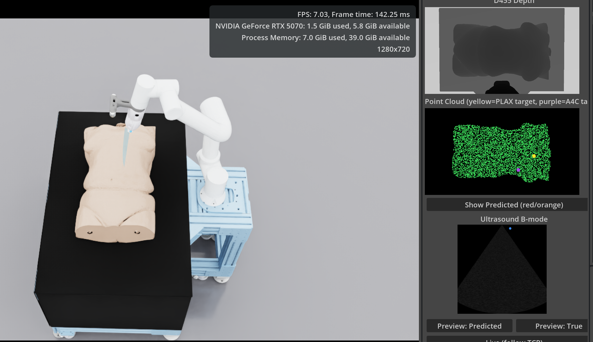

# Patient-Specific Digital Twins for Autonomous Echocardiography: Learning Initial Probe Placement from a Single Depth Observation

*Anonymous repository for double-blind review.*

<p align="center">
  
</p>

<p align="center">
  <i>Live verification tool — depth capture → point cloud (with predicted/true PLAX &amp; A4C targets) → simulated B-mode preview, running against the FR5 arm in Isaac Sim.</i>
</p>

---

## What this is

A pipeline for predicting the **initial probe contact point** for two standard
transthoracic echocardiography views (**PLAX** and **A4C**) directly from a single
depth-camera point cloud of a patient's torso — the "where do I put the probe first"
problem that precedes closed-loop ultrasound navigation, rather than the navigation
problem itself.

Given one point cloud from a wrist-mounted depth camera observing the torso before
contact, a shared-encoder, two-head PointNet regresses both contact points at once.
Training data comes from CT-derived torso phantoms simulated in Isaac Sim, with expert
PLAX/A4C probe poses annotated on the source CT volumes.

## What's in this repository

This anonymized snapshot includes the **model + training/evaluation code**, the
**Isaac Sim environment setup** used for depth capture and live verification, and
**5 example patient phantoms with their matching expert PLAX/A4C annotations**
(`data/example_annotations.json`), so the full loop — capture, predict, and check
against ground truth — can be run end-to-end without the full patient cohort. These
5 cases (`s1111`, `s0836`, `s0553`, `s1046`, `s0733`) are drawn from the public
[TotalSegmentator](https://github.com/wasserth/TotalSegmentator) v2.0.1 CT dataset;
the source CT volumes themselves aren't redistributed here (size/licensing), but are
freely obtainable from that public release under the same case IDs if you want the
simulated B-mode preview (`fr5_ct_slice_server.py`, not included in this snapshot) to
work against them.

**Deliberately excluded from this anonymous snapshot:**
- The remaining ~150 patients' phantoms and annotations (only the above 5 are
  included)
- Anything that could identify the authors or their institution (internal hostnames,
  IPs, and local filesystem paths have been replaced with placeholders throughout —
  see **Setup** below)

The full dataset and phantom library will be released publicly upon acceptance.

```
.
├── training/                  Model, training loop, and evaluation code (latest
│   │                           model only — see below)
│   ├── train_v4_aux.py            The model: shared-encoder two-head PointNet,
│   │                               residual regression + Huber loss + voxel-uniform
│   │                               point sampling + free anatomical auxiliary
│   │                               supervision (heart center, sternum tip, from CT
│   │                               segmentation masks). Includes the training loop
│   │                               and both evaluation protocols (plain + synthetic
│   │                               patient-repositioning shift).
│   ├── voxel_downsample_pointclouds.py   Point-cloud preprocessing
│   ├── extract_anatomical_aux_targets.py  Derives the free auxiliary targets from
│   │                               segmentation masks (no extra annotation cost)
│   ├── centroid_offset_baseline.py        Point-cloud-aware baseline used for
│   │                               comparison (predicts from the observed point
│   │                               cloud's centroid, not a constant)
│   ├── negative_control_chamber_visibility.py  Simulator validity check
│   ├── compute_v4_tangential_all.py       Surface-projected error metric
│   └── run_inference.py                   Run the trained model on ONE point cloud,
│                                            output in the exact format
│                                            fr5_prediction_check_window.py expects
│
├── isaac_sim_scripts/          Isaac Sim environment, capture, and live verification
│   ├── fr5_prediction_check_window.py   Live tool shown above: depth capture →
│   │                               point cloud → predicted/true target → simulated
│   │                               B-mode preview, with one-click robot motion to
│   │                               either predicted or ground-truth target
│   ├── go_to_initial_pose.py            Robot → fixed overhead camera pose
│   ├── go_to_target_pose.py             IK utilities + motion to a world-frame target
│   ├── save_d455_world_pose_for_sweep.py   One-time camera calibration cache
│   ├── capture_depth_full187.py         Resumable depth-capture sweep across cases
│   ├── stream_probe_to_ultrasound_server.py
│   └── live_ultrasound_window.py
│
├── assets/example_phantoms/     5 CT-derived torso phantom meshes (of the full
│   ├── s1111_skin.usd            multi-patient library) — s1111, s0836, s0553,
│   ├── s0836_skin.usd            s1046, s0733, matching data/example_annotations.json
│   ├── s0553_skin.usd            one-for-one
│   ├── s1046_skin.usd
│   └── s0733_skin.usd
│
├── data/
│   ├── example_annotations.json          Expert PLAX/A4C position + orientation for
│   │                                       the 5 cases above (CT-native RAS mm frame)
│   ├── example_case_local_centers_mm.json     Per-case bbox center, needed to convert
│   │                                       the annotations above into the
│   │                                       body-aligned local frame the model uses
│   └── example_case_local_bbox_mm.json    Per-case skin-mesh bounding box
│
└── docs/hero.png
```

## Setup

Paths that are specific to our lab environment have been replaced with placeholders —
set these before running anything:

| Placeholder | What it should point to |
|---|---|
| `<REPO_ROOT>` | This repository's root |
| `<DATA_ROOT>` | Directory holding the (not-yet-released) labeled training set |
| `<CT_DATASET_ROOT>` | Directory holding the source CT volumes + segmentation masks |
| `<SCRATCH_DIR>` | Any scratch/working directory |
| `<GPU_WORKSTATION_IP>` | Address of your own training machine, if remote |
| `<CHECKPOINT_PATH>` | Directory holding a trained model checkpoint (`model_best.pt`) |

Training/evaluation code (`training/`) requires PyTorch, NumPy, SciPy, trimesh, and
scikit-image. The Isaac Sim scripts (`isaac_sim_scripts/`) are run inside Isaac Sim's
own Python environment and additionally require the project's ultrasound-simulator
extension (CT-volume B-mode rendering) and the FR5 robot USD assets, neither of which
are included in this snapshot.

## Running inference in Isaac Sim

The 5 example phantoms (`assets/example_phantoms/`) and their matching annotations
(`data/example_annotations.json`) are enough to run the full loop — capture → predict
→ check against ground truth, on any of the 5, end to end, without the full patient
cohort. Trained checkpoints aren't included in this snapshot (see **Status**); once
you have one (either your own, trained with `training/train_v4_aux.py`, or the
released checkpoint after acceptance), the steps are:

**1. Load the scene and capture a point cloud (inside Isaac Sim).**
Open the FR5 + ultrasound scene with one of `assets/example_phantoms/*.usd`
referenced in as the torso phantom. `isaac_sim_scripts/go_to_initial_pose.py` moves
the arm to the fixed overhead camera pose the model was trained on; from there, a
depth-camera capture of the torso (see `isaac_sim_scripts/capture_depth_full187.py`
for the batch-capture pattern this project uses — the same per-case logic applies to
a single live case) gives you a point cloud in the camera frame, which then needs
converting into the body-aligned local mm frame the model expects — bbox-centered on
the subject's own skin mesh, using that case's own entry in
`data/example_case_local_centers_mm.json`/`example_case_local_bbox_mm.json` (see the
paper's coordinate-system section for the exact transform). Save it as a `.npy` array
of `(N, 3)` points in millimeters.

**2. Run the model (standard Python, outside Isaac Sim).**
```bash
python training/run_inference.py \
    --checkpoint <CHECKPOINT_PATH>/model_best.pt \
    --pointcloud path/to/captured_pointcloud_local_mm.npy \
    --case-id s1111 \
    --out predictions.json
```
This prints the predicted PLAX and A4C contact points (body-aligned local mm frame)
and writes `predictions.json` in the exact schema
`isaac_sim_scripts/fr5_prediction_check_window.py` reads. Since ground truth for
`s1111`/`s0836`/`s0553`/`s1046`/`s0733` is included
(`data/example_annotations.json`, converted to the local frame the same way as the
point cloud above), you can also pass it in to get a genuine error number rather than
a placeholder:
```bash
    --gt-json path/to/example_annotations_local_mm.json
```

**3. Visualize the result and drive the robot there (back inside Isaac Sim).**
With `fr5_ct_slice_server.py` running (`CT_NIFTI_PATH` pointing at your case's CT
volume, obtainable from the public TotalSegmentator v2.0.1 release under the same
case ID — needed only for the simulated B-mode preview panel, not for the position
prediction itself) and `isaac_sim_scripts/go_to_target_pose.py` already run once in
the same Script Editor session (its update subscription is what applies joint-angle
changes each frame — see the comment at the top of
`fr5_prediction_check_window.py`), point that script's predictions-file path at your
`predictions.json`, set `CASE_ID`/`VIEW` to match, and paste-run it. This opens the
live window shown at the top of this README: D455 depth, the point cloud with your
predicted target, and a simulated B-mode preview at that position — with a button to
drive the arm's probe there directly.

## Model summary

Shared PointNet-style encoder (per-point MLP + max-pool) feeding two independent
regression heads (PLAX, A4C). Trained on point clouds subsampled from a
voxel-uniform downsampling of the raw depth capture, with:
- **Residual targets** — the network predicts the offset from the training-set mean
  position rather than an absolute coordinate, so it is lower-bounded by that
  frame-anchored floor by construction.
- **Free auxiliary supervision** — two extra heads predict the heart centroid and
  the inferior sternum tip, extracted at zero additional annotation cost from
  existing CT segmentation masks, regularizing the shared encoder toward inferring
  internal anatomy from surface geometry.
- **Aggressive translation-jitter augmentation**, matched by an evaluation protocol
  that injects a synthetic patient-repositioning shift — a deployed system never
  gets the fixed, idealized capture geometry a simulation makes convenient.

## Status

Code accompanying a submission currently under double-blind review. Questions and
issues can be raised via this repository; author identity will be revealed upon
completion of the review process.
